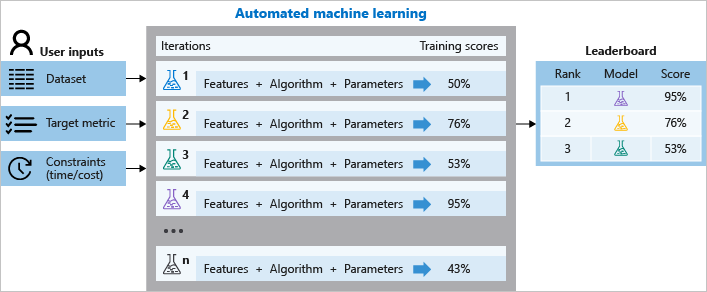

# Optimizing an ML Pipeline in Azure

* [Overview](#overview)
* [Summary](#summary)
* [HyperDrive](#hyperdrive)
* [AutoML](#automl)
* [Comparison](#comparison)
* [Improvements](#improvements)

## Overview
This project is part of the Udacity Azure ML Nanodegree.
In this project, we build and optimize an Azure ML pipeline using the Python SDK and a provided Scikit-learn model.
This model is then compared to an Azure AutoML run.

## Summary
The data is related with direct marketing campaigns of a Portuguese banking institution. The marketing campaigns were based on phone calls. Often, more than one contact to the same client was required, in order to access if the product (bank term deposit) would be ('yes') or not ('no') subscribed. The classification goal is to predict if the client will subscribe (yes/no) a term deposit (variable y). [Link to the dataset](https://archive.ics.uci.edu/ml/datasets/bank+marketing).

The best performing model was a VotingEnsemble Algorithm generated by AutoML with an accuracy score of 0.91708. Generated by HyperDrive, the Logistic Regression Algorithm performed equally well with an accuracy score of 0.91296.

## HyperDrive
**HyperDrive Pipeline:**
1. Start Workspace
2. Create/Use compute instance
3. Create HyperDriveConfig\
3.1 Specify parameter sampler\
3.2 Specify policy for early stopping\
3.3 Create estimator
4. Run HyperDrive experiment
5. Select best hyperparameters/run/model
6. Save best model
7. Register best model

**Classification Algorithm:**\
LogisticRegression - sklearn.linear_model - [Link to scikit-learn](https://scikit-learn.org/stable/modules/generated/sklearn.linear_model.LogisticRegression.html).

A logistic regression models the probabilities for classification problems with two possible outcomes. It's an extension of the linear regression model for classification problems. Instead of fitting a straight line, the logistic regression model uses the logistic function to squeeze the output of a linear equation between 0 and 1. In other words, it transforms its output using the logistic sigmoid function to return a probability value which can then be mapped to two or more discrete classes.

**Hyperparameter Tuning via HyperDrive:**\
3. Primary metric to optimse: Accuracy.\
3.1 Parameter space / hyperparameters to optimise: regularization strength between 0 and 1 (C) & maximum iterations of 10, 50 or 100 (max_iter).

The parameter sampler helps to find the optimal hyperparameters by randomly sampling combinations of them. The regularization strength hyperparameter (C) is set to ensure that our model does not overfit the data by penalizing addition of features. The maximum iteration hyperparameter (max_iter) controls the number of iterations to be done before we select our final model.

- What are the benefits of the chosen parameter sampler?\

RandomParameterSampling defines random sampling over a hyperparameter search space. It is optimised for speed because it picks randomly hyperparameter values instead of going though every single value, i.e., it allows to achieve an optimal primary metric for a relatively short period of time.

- What are the benefits of the chosen early stopping policy?\

Early termination policy automatically terminates poorly performing runs with an early termination policy, hence improves computational efficiency. Bandit Policy terminates runs which fall outside of the top n% range every k interval, saving time of the experiment. In this project, any run whose best metric is less than (1/(1+0.1) or 91% of the best performing run will be terminated. Microsoft recommends for a conservative policy that provides savings without terminating promising jobs, consider a Median Stopping Policy. For more aggressive savings, use Bandit Policy. In other words, Bandit Policy saves time and resources.

**Final model metric:**\
Accuracy: 0.91296\
Max iterations: 100\
Regularization Strength: 0.95150

## AutoML
**AutoML Pipeline:**
1. Create Dataset
2. Split data into train and test sets
3. Set parameters for AutoMLConfig
4. Submit AutoML run
5. Save best model

\
The diagram above illustrates the concept of AutoML.
1. Identify the ML problem (here: classification)
2. Choose either Python SDK or studio web experience (here: Python SDK)
3. Format labeled training data (here: Pandas)
4. Configure compute target for model training (here: local)
5. Configure AutoML parameters (here: e.g. metrics: accuracy)
6. Submit run
7. Review results (here: voting ensemble)

In the case of this project, the Voting Ensemble algorithm performed best with an accuracy of 0.91708. Ensemble modeling is a process where multiple diverse models are created with the aim to aggregate the predictions of each base model, resulting in one final prediction for the unseen data that is usually more accurate than the each one returned by each single model. Basically, ensembling strategies reduce the generalization error of the prediction. Two types can be differentiated:
- Voting: soft-voting which uses weighted averages (see below).
- Stacking: two layers are used, where the first layer has the same models as the voting ensemble, and the second layer model is used to find the optimal combination of the models from the first layer (performed worse in this project).

As a side fact: Out of 15 total runs, Random Forest (including MaxAbsScalar featurization; scales each feature by its maximum absolute value) performed worst with an accuracy of only 0.79176.

**VotingEnsemble Algorithm:**\
**Ensembled_algorithms:** ['LightGBM', 'XGBoostClassifier', 'XGBoostClassifier', 'XGBoostClassifier', 'LogisticRegression', 'RandomForest', 'RandomForest', 'RandomForest']\
**Ensemble_weights:** [0.35714285714285715, 0.07142857142857142, 0.07142857142857142, 0.07142857142857142, 0.07142857142857142, 0.07142857142857142, 0.14285714285714285, 0.14285714285714285]

As one can see, the highest weight of the ensemble was given to the LightGBM algorithm. LightGBM is a gradient boosting framework that uses tree based learning algorithms. Boosting is an ensemble method for improving the model predictions of any given learning algorithm. The idea of boosting is to train weak learners sequentially, each trying to correct its predecessor. The Gradient Boosting Method tries to fit the new predictor to the residual errors made by the previous predictor. By combining weak learner after weak learner, the final model is able to account for a lot of the error from the original model and reduces this error over time.

**Final model metric:**\
Accuracy: 0.91708

## Comparison
HyperDrive and AutoML performed equally well in terms of accuracy. Unlike AutoML, which generates ensemble models (combination of multiple models), HyperDrive sticks with one algorithm only (logistic regression). Whereas HyperDrive tunes hyperparamters only, AutoML selects different estimators, engineers different features and chooses different hypterparameters all at once. Keeping that in mind, it is somewhat suprising how well the Logistic Regression (HyperDrive) performed.

## Improvements
- Imbalanced data handeling

Data guardrails are run by AutoML when automatic featurization is enabled. This is a sequence of checks over the input data to ensure high quality data is being used to train models. In this case, imbalanced classes were detected in the dataset by AutoML, which could lead to a falsely perceived positive effect of a model's accuracy because the input data has bias towards one class.

One way of dealing with this imbalance could be using a performance metric that deals better with imbalanced data. For example, the AUC_weighted is a primary metric that calculates the contribution of every class based on the relative number of samples representing that class, hence is more robust against imbalance. Another one would be the F1 score. However, the correct way would be to resample the input data to even the class imbalance, either by up-sampling the smaller classes or down-sampling the larger classes.

## Instance
**Deletion of instance**
\